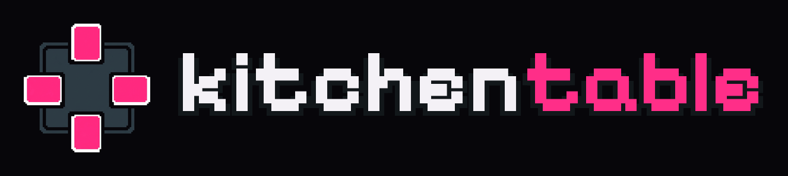
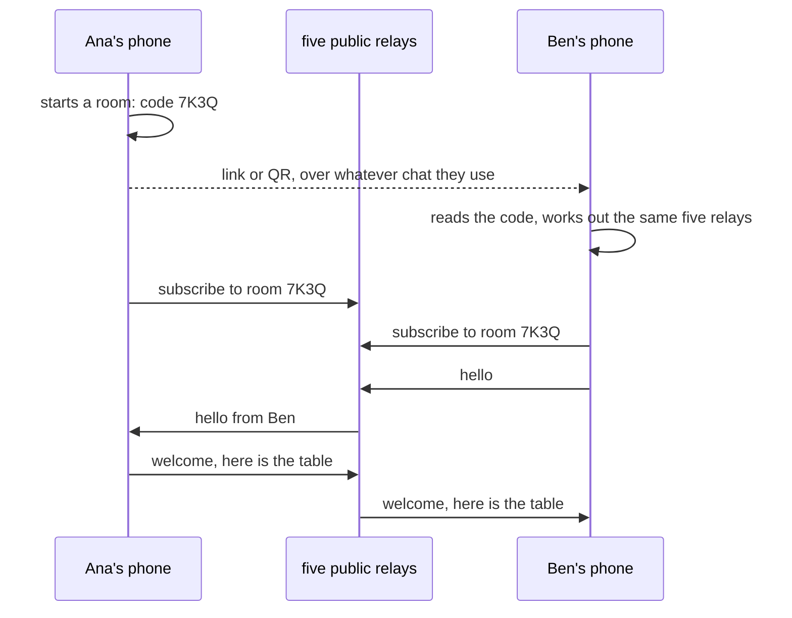
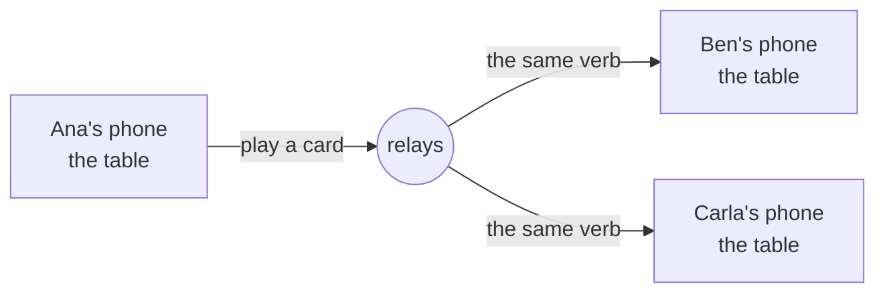
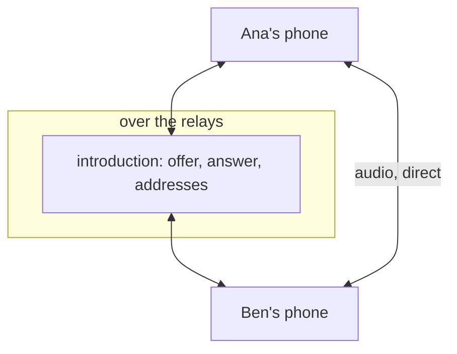

A card table for playing with friends who are somewhere else.

You bring the cards. The app brings the table, the shuffler, the dice and the
connection. Nobody runs a server, nobody makes an account, and nothing is sold.

**Play it now: [hiitsgabe.github.io/kitchentable](https://hiitsgabe.github.io/kitchentable/)**
in any browser, phone or desktop. Android packages are on the
[releases page](https://github.com/hiitsgabe/kitchentable/releases/latest).

## The idea

"Kitchen table" is what people call the version of a card game you play at home
with friends. No judge, no clock, no sanctioning. If a rule comes up, somebody
reads the card out loud and the table agrees on what it means. That is the game
this app is for.

So kitchentable does not know the rules, and that is a decision, not a gap. It
knows how to move a card from one pile to another, rotate it, flip it, put a
counter on it, attach something to it, shuffle a deck and deal a hand. A dozen
verbs, give or take. It turns out that is enough to play Magic, and enough to
play Pokemon, because every tabletop card game is piles of cards with state on
them.

Later, a rules engine can be plugged in behind the table as a referee. The
seam is there from the start. It is not there yet.

## What it is not

It is not a card database. The app ships empty and makes no network request
until you explicitly switch a source on. It has no cards bundled, no images
bundled, and no default that phones home.

It is not a store, a marketplace or a subscription. It never will be.

It is not affiliated with, endorsed by or approved by Wizards of the Coast,
Hasbro, The Pokemon Company or Nintendo. Card names, card text and card images
belong to their publishers. You point the app at a data source, and what
arrives on your device came from you asking for it.

## Where the cards come from

Nowhere, until you say so. Settings has a list of sources, each off until you
run it: [Scryfall](https://scryfall.com/) for the Magic cards,
[MTGJSON](https://mtgjson.com/) for the sets a draft is made of,
[pokemon-tcg-data](https://github.com/PokemonTCG/pokemon-tcg-data) for
Pokemon, and a file of your own. An import is a download onto your device
and nothing else; the list says what size it is before you start.

This is also why the app survives its data sources. The Pokemon TCG API is
scheduled to go offline in March 2027. The raw data behind it is a git
repository and will outlive the API. Importing instead of calling is not a
compromise here, it is the robust option.

## How the phones find each other

There is no server of ours. What there is instead:

1. **The room is a code.** Whoever starts a game gets a short random code.
   The room screen shows it three ways: a link to send, a QR to scan across
   the table, and the seven characters themselves to type or read out. That
   is the whole invitation.
2. **The code says where to meet.** From the code alone, every phone works
   out the same five public relays (shuffled out of a pool of eighteen) and
   the same channel on them. Nobody is told where to look; everybody arrives
   at the same place by arithmetic.
3. **The relays carry the game.** Public [Nostr](https://nostr.com/) relays
   are free, plentiful, and reached with an ordinary outbound connection,
   which is the one thing every Wi-Fi, carrier and NAT allows. A move is a
   small signed message to the relay, and the relay hands it to everybody
   else in the room.



Every phone holds the whole table. What travels is the verb, never the
screen: "move card 12 to Ana's graveyard" goes to the relays, the relays fan
it out, and every phone applies the same verb to the same table and gets the
same table. That is also why undo works and why somebody arriving late is
handed one snapshot and is then level with everyone.



The cost is the relay in the path: a move is a round trip to it and back,
about a fifth of a second, and a relay sees the traffic go by. For friends
playing cards that is a fair trade for a connection that needs nothing set
up and works on any network.

**Voice** is the one thing that goes phone to phone. Enable it in the room
settings and each pair of phones opens a direct audio link ([WebRTC](https://webrtc.org/)),
introduced to each other over the relays that already work. Most pairs
connect straight across; a pair that cannot (two strict carrier networks)
needs a relay for the audio too, which is a TURN server you can enter in
Settings. The game itself never needs one.



Text chat rides the same wire as the game and is kept apart from it: a line
of chat is not something that happened to the cards, so undo never touches it.

## What works today

- A table for Magic and Pokemon: library, hand, battlefield, graveyard,
  exile and command zone, the verbs to move cards between them, and a life
  total or a prize count on every seat. Counters, tapping, flipping,
  attaching, tokens, dice.
- The opening hand dealt out, and the London mulligan.
- Decks: made by hand, pasted as a list, built from the sources you have.
- Rooms by link or QR, text chat, voice chat.
- Three views of the table (grid, focus, split), scaled for a phone, a
  tablet and a desktop browser.

Not yet: a rules engine, draft with real booster odds, looking at or taking
from another player's hand, and desktop builds.

## Running it

Flutter 3.47.5 or newer.

```
flutter pub get
flutter run
```

Android, iOS and web are the configured targets. Desktop is not set up yet and
is a one line change when somebody wants it.

Two things are set at build time with `--dart-define`:

- `HOME_URL`, where a room link points. It should be the web build's address,
  so a friend without the app lands in the browser. The published builds use
  `https://hiitsgabe.github.io/kitchentable/`.
- `BUILD`, shown in Settings so two phones can check they run the same thing.

```
flutter build web --base-href /kitchentable/ --pwa-strategy=none \
  --dart-define=HOME_URL=https://hiitsgabe.github.io/kitchentable/
```

### Builds

- Every push to `main` deploys the web build to GitHub Pages
  (`.github/workflows/pages.yml`).
- `Build and Release`, run by hand from the Actions tab, bumps the version,
  tags it, and publishes Android packages and a zip of the web build
  (`.github/workflows/release.yml`).

## License

MIT, see [LICENSE](LICENSE). That covers the code in this repository and
nothing else. It says nothing about the card data you choose to load, which is
not ours to license.
